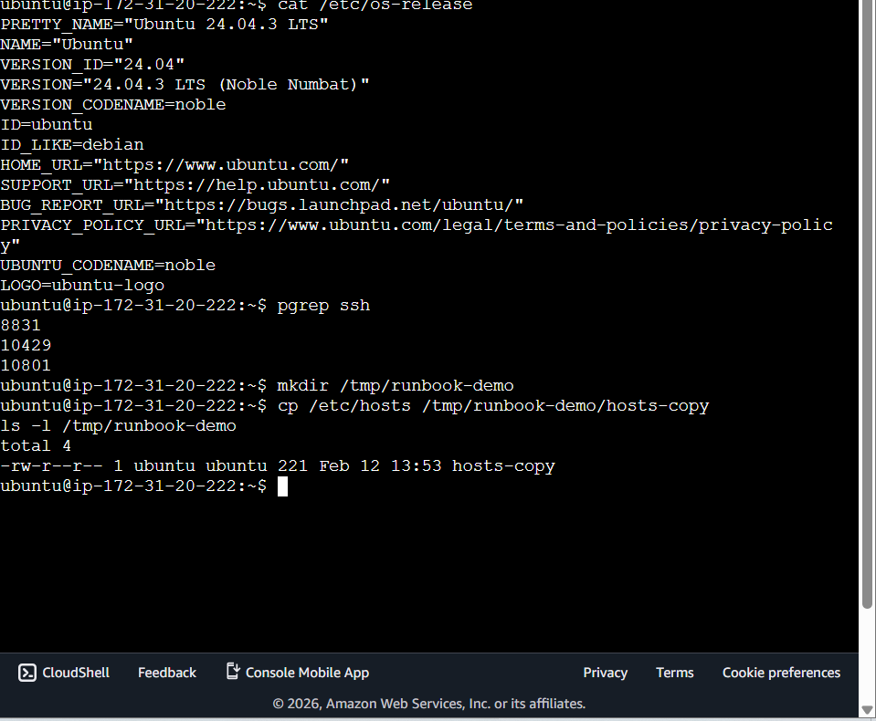

# Day 05 – Linux Troubleshooting Drill: CPU, Memory, and Logs

🔥 STEP 0 — Pick Your Target Service

First check running services:

systemctl list-units --type=service --state=running

👉 Pick ONE service (recommended: ssh or cron).

Let’s assume you choose:

ssh.service

Write this in your runbook:

Target Service: ssh.service

✅ STEP 1 — Environment Basics (2 Commands)
1️⃣ Run:
uname -a

Observe:

Kernel version

Architecture (x86_64)

Hostname

Write:

Kernel: 5.x.x
Arch: x86_64
System running normally

2️⃣ Run:
cat /etc/os-release

Observe:

OS name (Ubuntu 22.04 etc.)

Version

Write:

OS: Ubuntu 22.04 LTS
Version confirmed

✅ STEP 2 — Filesystem Sanity Check (2 Commands)
Run:
mkdir /tmp/runbook-demo

4️⃣ Run:
cp /etc/hosts /tmp/runbook-demo/hosts-copy
ls -l /tmp/runbook-demo

Observe:

Folder created

File copied

Permissions visible

STEP 3 — CPU & Memory Snapshot
5️⃣ Get PID of service:
pgrep ssh

Copy the PID.

6️⃣ Check CPU & Memory usage:
ps -o pid,pcpu,pmem,comm -p <PID>

Observe:

CPU < 5% → normal

Memory low → normal
