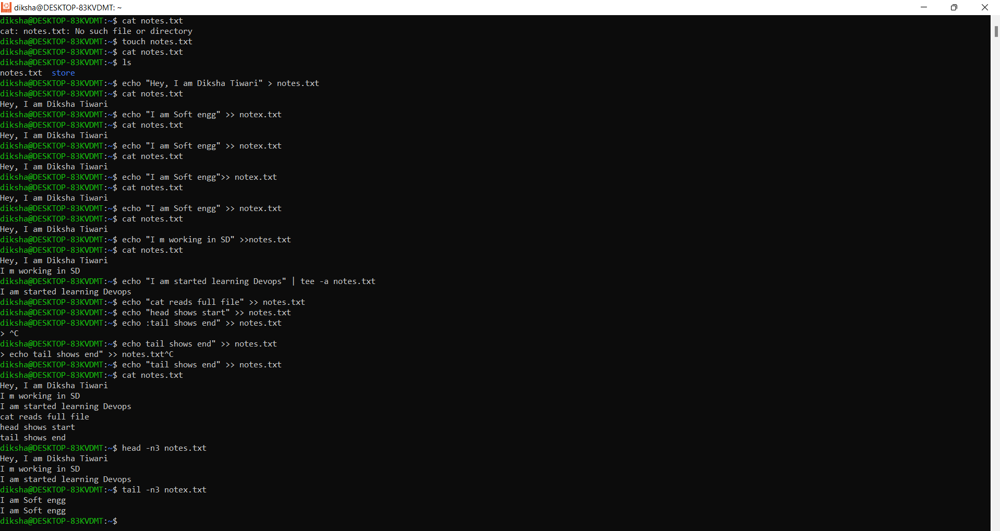

# Day 06 – Linux Fundamentals: Read and Write Text Files

    ✅ 1. Create the file
        touch notes.txt
        What it does: Creates an empty file named notes.txt.

    ✅ 2. Write first line (overwrite)
        echo "Line 1" > notes.txt
        What it does: Writes text into file. > overwrites existing content.

    ✅ 3. Add second line (append)
        echo "Line 2" >> notes.txt
        What it does: Adds text without deleting old content.
         > > appends to file.

    ✅ 4. Use tee (write + display)
        echo "Line 3" | tee -a notes.txt

        What it does:Prints line on terminal
        Saves it into file -a = append mode

    ✅ 5. Read full file
        cat notes.txt
        What it does: Displays entire file content.

    ✅ 6. Read first lines
        head -n 2 notes.txt
        What it does: Shows first 2 lines of file.

    ✅ 7. Read last lines
        tail -n 2 notes.txt
        What it does: Shows last 2 lines of file.

      🧠 Interview One-Liner
      I used redirection (> and >>) to write into a file, tee to write and display output, and cat/head/tail to read full and partial file content.

