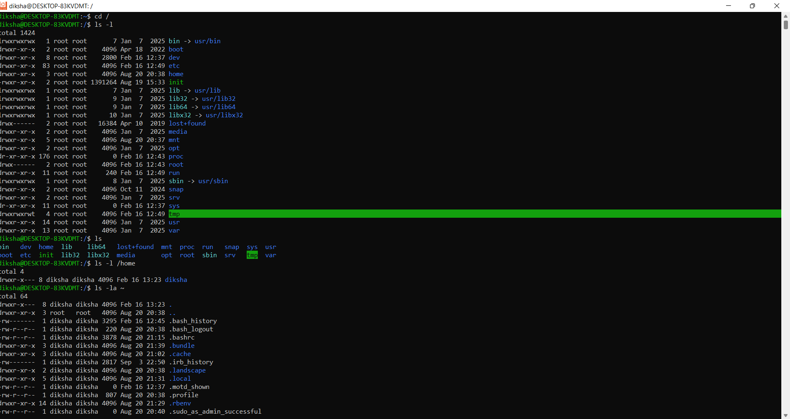
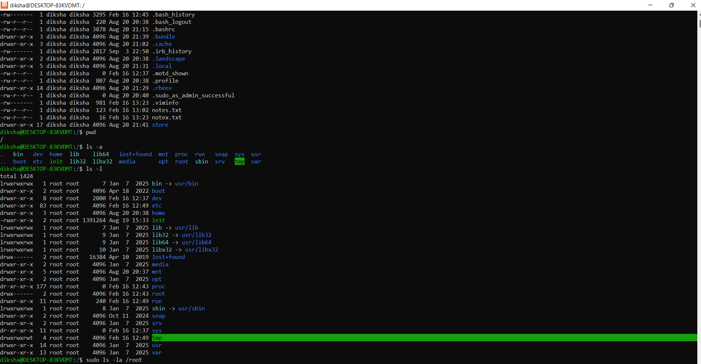
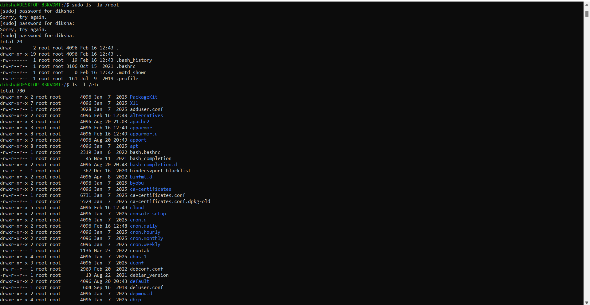
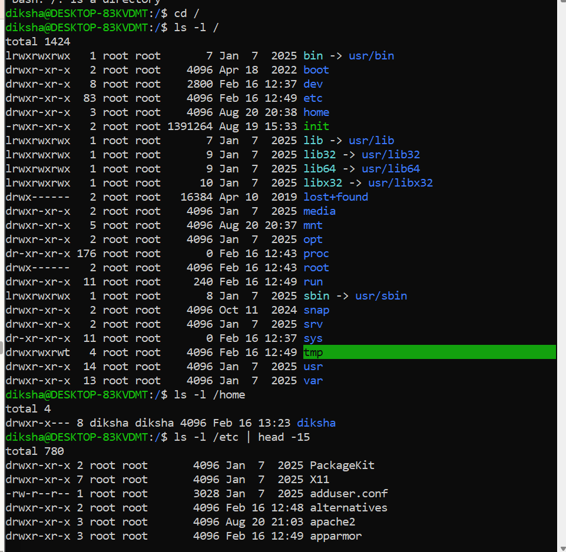
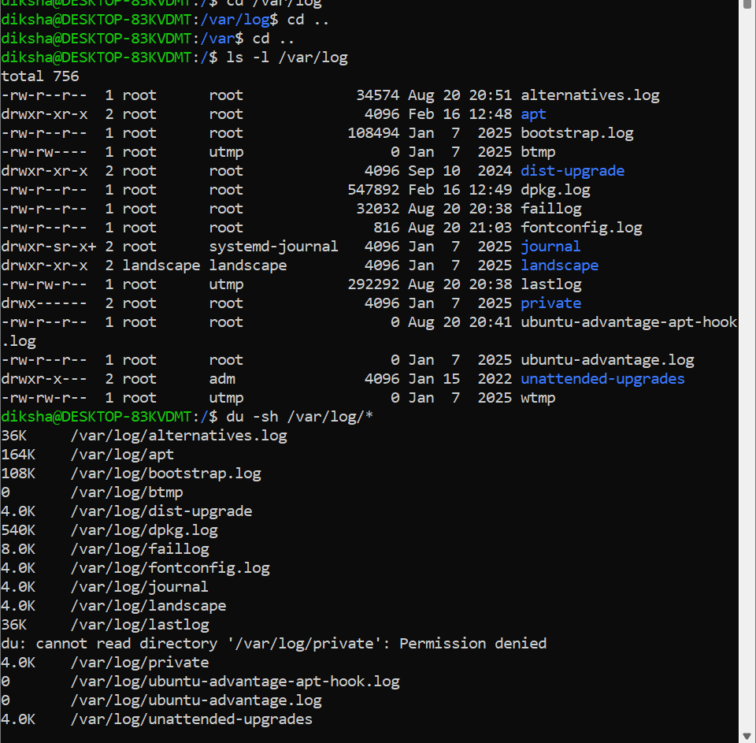
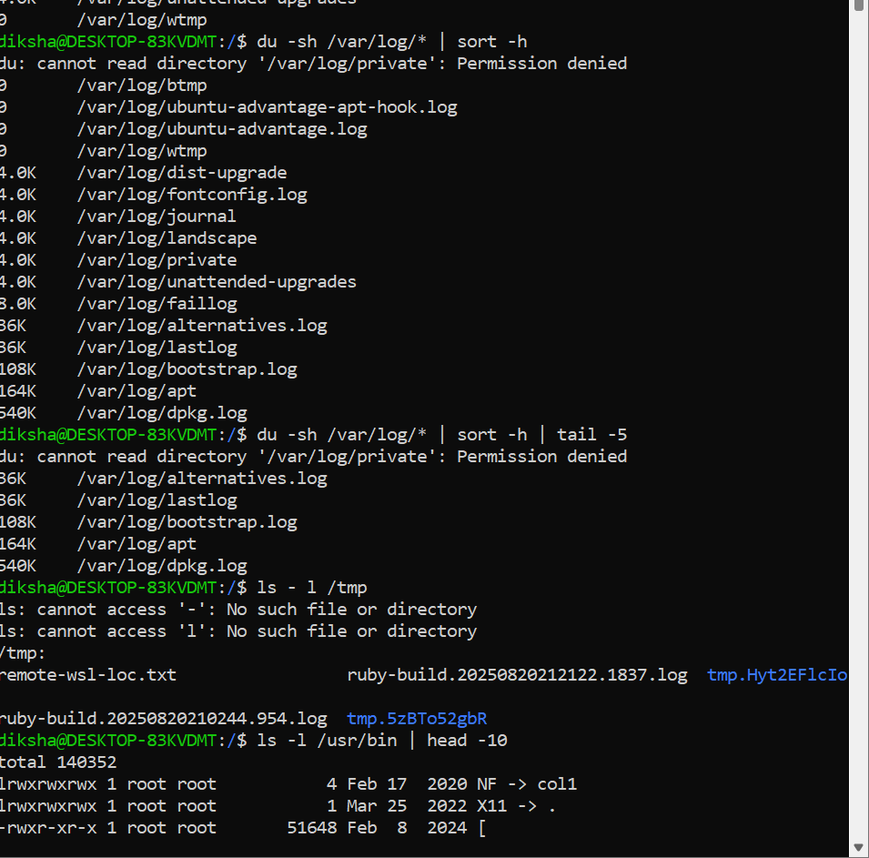
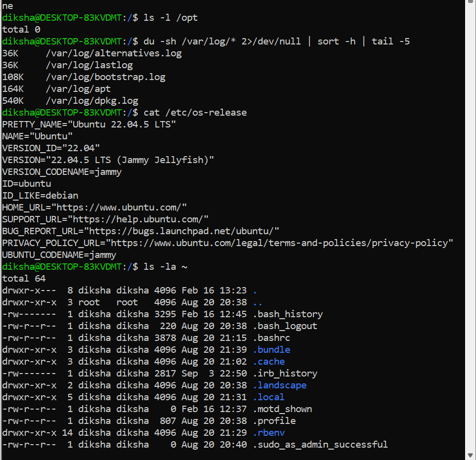

# Day 07 – Linux File System Hierarchy & Scenario-Based Practice

Part 1: - Linux File System Hierarchy & Practice

1. / (Root Directory)
   What it contains: The top-level directory. Everything in Linux starts here.
   Commands to explore:
   bash# List all directories in root
   ls -l /
   What you'll see: bin, boot, dev, etc, home, lib, opt, root, tmp, usr, var
   Explanation:

ls = list contents
-l = long format (shows permissions, owner, size, date)

I would use this when: Understanding the complete structure of the Linux system.

2. /home (User Home Directories)
   What it contains: Personal folders for each user on the system.
   Commands to explore:
   bash# List all user directories
   ls -l /home

# Check your own home directory

ls -la ~

# See where you are currently

pwd
What you'll see: Folders like ubuntu, john, admin (user names)
Explanation:

~ = shortcut for your home directory
-a = show all files (including hidden files that start with .)
pwd = print working directory (shows current location)

I would use this when: Storing personal files, scripts, or configurations.

3. /root (Root User's Home)
   What it contains: Home directory for the system administrator (root user).
   Commands to explore:
   bash# View root's home directory (needs sudo)
   sudo ls -la /root
   What you'll see: .bashrc, .profile, .ssh (configuration files)
   Explanation:

sudo = run command as superuser/administrator
Hidden files (starting with .) are configuration files

I would use this when: Working as administrator or storing system-level scripts.

4. /etc (Configuration Files)
   What it contains: System-wide configuration files for all applications.
   Commands to explore:
   bash# List configuration directory
   ls -l /etc

# View your system's hostname

cat /etc/hostname

# See all user accounts

cat /etc/passwd

# View network hosts file

cat /etc/hosts
What you'll see: passwd, hostname, hosts, ssh/, nginx/, apache2/
Explanation:

cat = display file contents
/etc/passwd = user account info (not actual passwords!)
/etc/hostname = your computer's name
/etc/hosts = local DNS mappings

I would use this when: Configuring services, changing settings, or managing system behavior.

5. /var/log (Log Files)
   What it contains: All system and application logs. MOST IMPORTANT for DevOps!
   Commands to explore:
   bash# List all log files
   ls -l /var/log

# View last 20 lines of system log

sudo tail -20 /var/log/syslog

# Follow system log in real-time

sudo tail -f /var/log/syslog

# Check who logged in

sudo tail -20 /var/log/auth.log

# Find the 5 largest log files

sudo du -sh /var/log/\* 2>/dev/null | sort -h | tail -5
What you'll see: syslog, auth.log, kern.log, nginx/, apache2/
Explanation:

tail = show last lines of a file
-20 = show last 20 lines
-f = follow mode (watch new lines appear in real-time)
du = disk usage
-s = summary
-h = human-readable (KB, MB, GB)
sort -h = sort by size
2>/dev/null = hide error messages

I would use this when: Debugging errors, checking login attempts, or troubleshooting services.

6. /tmp (Temporary Files)
   What it contains: Temporary files that get deleted on reboot.
   Commands to explore:
   bash# List temporary files
   ls -l /tmp

# Create a test file

echo "This is temporary" > /tmp/test.txt

# View the file

cat /tmp/test.txt

# Remove the file

rm /tmp/test.txt
What you'll see: Random temporary files and directories
Explanation:

echo = print text

> = redirect output to file (creates/overwrites file)
> rm = remove/delete file

I would use this when: Testing scripts or storing data that doesn't need to be permanent.

7. /bin (Essential Binaries)
   What it contains: Basic commands needed for the system to work.
   Commands to explore:
   bash# List essential commands
   ls -l /bin

# Find where 'ls' command is located

which ls

# Find where 'cat' command is located

which cat
What you'll see: bash, cat, cp, ls, mkdir, rm, grep
Explanation:

which = shows the full path of a command

I would use this when: Understanding where basic system commands are stored.

8. /usr/bin (User Binaries)
   What it contains: Additional user programs and applications.
   Commands to explore:
   bash# List user programs
   ls -l /usr/bin

# Find Python location

which python3

# Find Git location

which git
What you'll see: python3, git, vim, nano, docker, node
Explanation:

Most installed applications go here

I would use this when: Installing development tools or third-party software.

9. /opt (Optional Applications)
   What it contains: Manually installed third-party software.
   Commands to explore:
   bash# List optional software
   ls -l /opt
   What you'll see: google/, docker/, custom-app/ (varies by system)
   I would use this when: Installing commercial software or custom applications.

Complete Hands-On Practice Tasks
Task 1: Explore System Information
bash# Your system's name
cat /etc/hostname

# Your system's OS version

cat /etc/os-release

# Check current date

date

# Check system uptime

uptime
Explanation:

os-release = contains OS distribution info
date = shows current date and time
uptime = shows how long system has been running

Task 2: Find Large Log Files
bash# Find 5 largest log files
sudo du -sh /var/log/\* 2>/dev/null | sort -h | tail -5

# Check total size of /var/log

sudo du -sh /var/log
Explanation:

du -sh /var/log/\* = size of each file in /var/log
sort -h = sort by human-readable sizes (1K, 1M, 1G)
tail -5 = show last 5 (largest) files

Task 3: Explore Your Home Directory
bash# List all files including hidden ones
ls -la ~

# See hidden configuration files

ls -la ~ | grep "^\."

# Check your bash history

tail -20 ~/.bash_history
Explanation:

Files starting with . are hidden
grep "^\." = filter lines starting with .
.bash_history = stores your command history

Task 4: Check Disk Space
bash# Check disk usage of all partitions
df -h

# Check size of home directory

du -sh ~

# Find large files in home directory

du -sh ~/\* 2>/dev/null | sort -h | tail -5
Explanation:

df = disk filesystem (shows disk partitions)
-h = human-readable format
Shows how much space is used and available

Task 5: View Running Processes
bash# Show all running processes
ps aux

# Show processes in real-time

top

# Find specific process

ps aux | grep nginx
Explanation:

ps = process status
aux = all users (a), user-oriented (u), include background (x)
top = real-time process monitor (press 'q' to quit)
grep = filter/search for pattern

Task 6: File Permissions Practice
bash# Create a test script
echo "echo 'Hello World'" > ~/test.sh

# Check its permissions

ls -l ~/test.sh

# Make it executable

chmod +x ~/test.sh

# Run it

./test.sh

# Remove it

rm ~/test.sh
Explanation:

chmod = change mode/permissions
+x = add execute permission
./ = run file in current directory

Task 7: Search in Files
bash# Search for word in a file
grep "root" /etc/passwd

# Search for pattern in all config files

grep -r "localhost" /etc/

# Count lines in a file

wc -l /etc/passwd
Explanation:

grep = search for text pattern
-r = recursive (search in all subdirectories)
wc -l = word count, lines

Task 8: Create Directory Structure
bash# Create a project directory
mkdir -p ~/projects/devops/scripts

# Navigate to it

cd ~/projects/devops/scripts

# Check where you are

pwd

# Go back to home

cd ~
Explanation:

mkdir = make directory
-p = create parent directories if they don't exist
cd = change directory

Quick Command Cheat Sheet
CommandWhat it doesExamplelsList filesls -lacdChange directorycd /var/logpwdShow current directorypwdcatDisplay filecat /etc/hostnametailShow last linestail -20 file.txtheadShow first lineshead -10 file.txtgrepSearch textgrep "error" log.txtduDisk usagedu -sh /var/logdfDisk spacedf -hwhichFind command locationwhich python3chmodChange permissionschmod +x script.shmkdirCreate directorymkdir folderrmRemove filerm file.txtpsShow processesps auxtopProcess monitortop

Practice Exercise
Challenge: Complete all these commands in order and observe the output!
bash# 1. Check where you are
pwd

# 2. View your home directory

ls -la ~

# 3. Check system hostname

cat /etc/hostname

# 4. Find 5 largest log files

sudo du -sh /var/log/\* 2>/dev/null | sort -h | tail -5

# 5. Check disk space

df -h

# 6. View last 20 system log entries

sudo tail -20 /var/log/syslog

# 7. Create a test directory

mkdir -p ~/devops-practice

# 8. Create a test file

echo "DevOps Day 7 Practice" > ~/devops-practice/notes.txt

# 9. View the file

cat ~/devops-practice/notes.txt

# 10. Clean up

rm -rf ~/devops-practice

<!-- ===================== -->

