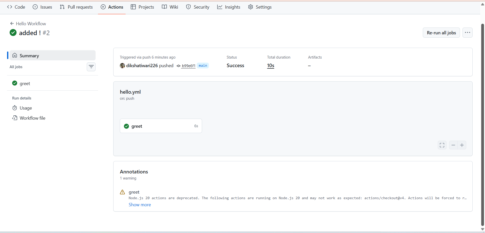
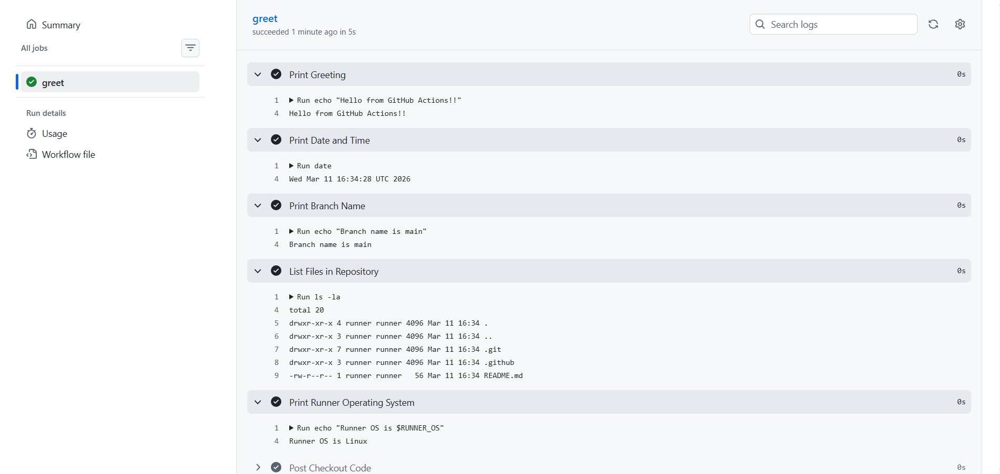
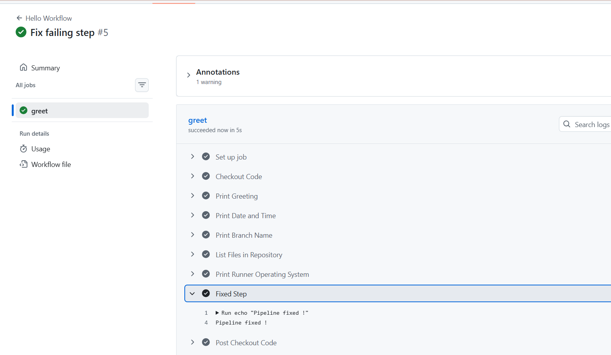

### Task 2: Hello Workflow

### Task 3: Understand the Anatomy

| Key       | Purpose                         |
| --------- | ------------------------------- |
| `on`      | Defines when workflow runs      |
| `jobs`    | Groups tasks to execute         |
| `runs-on` | Specifies runner OS             |
| `steps`   | Sequence of actions in a job    |
| `uses`    | Runs a predefined GitHub Action |
| `run`     | Executes shell commands         |
| `name`    | Describes a step in logs        |

### Task 4: Add More Steps

### Task 5: Break It On Purpose

What does a failed pipeline look like?

The workflow shows a red ❌ status in the GitHub Actions tab.
The step where the error occurs is marked failed.
All steps after that do not run (skipped).

How do you read the error?

Open Actions tab in the repository.
Click the failed workflow run.
Open the failed job and step.
Read the logs to see the error message and exit code.

**Fix the Workflow**

