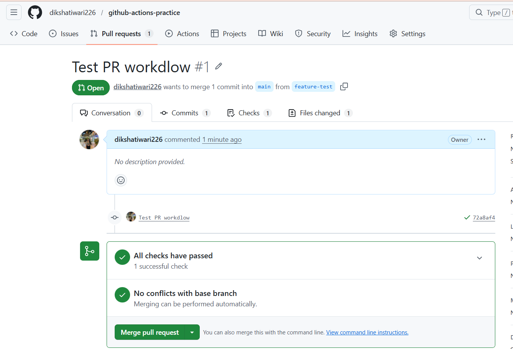
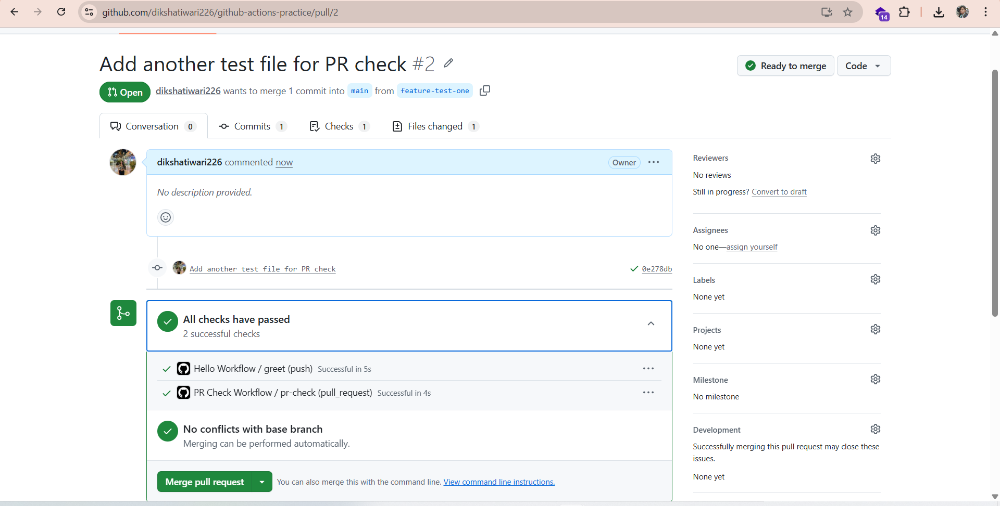
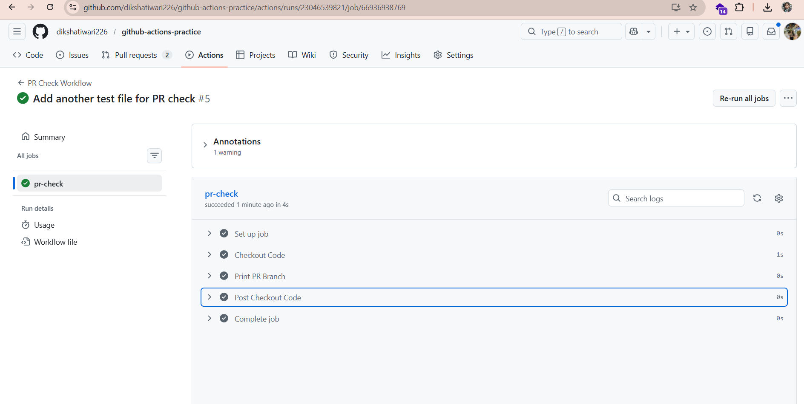
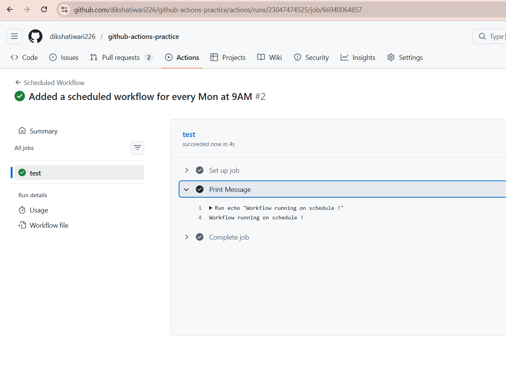
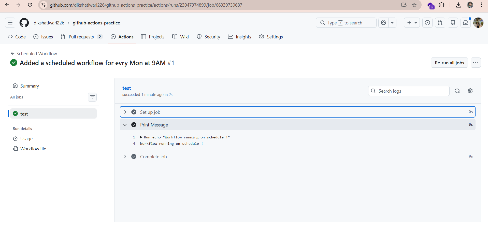
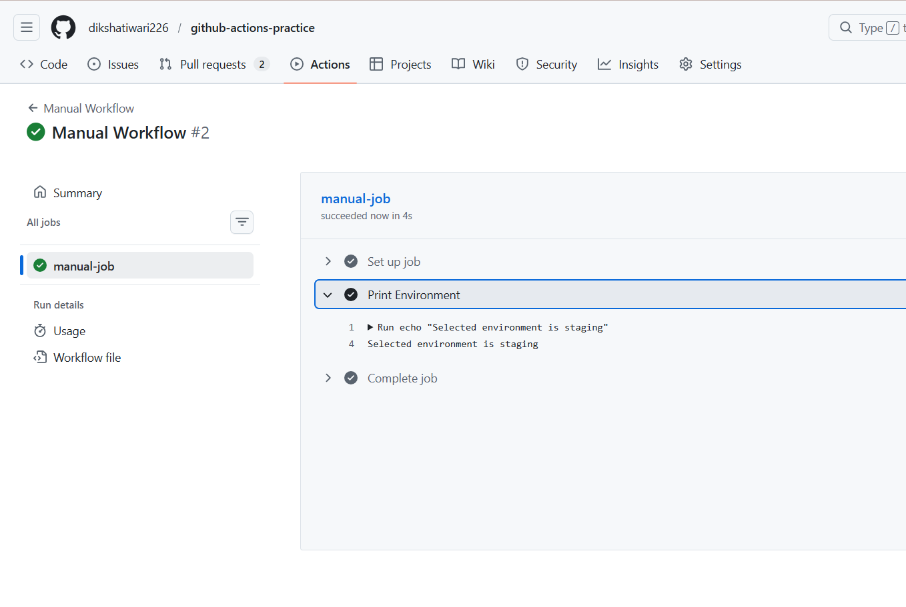
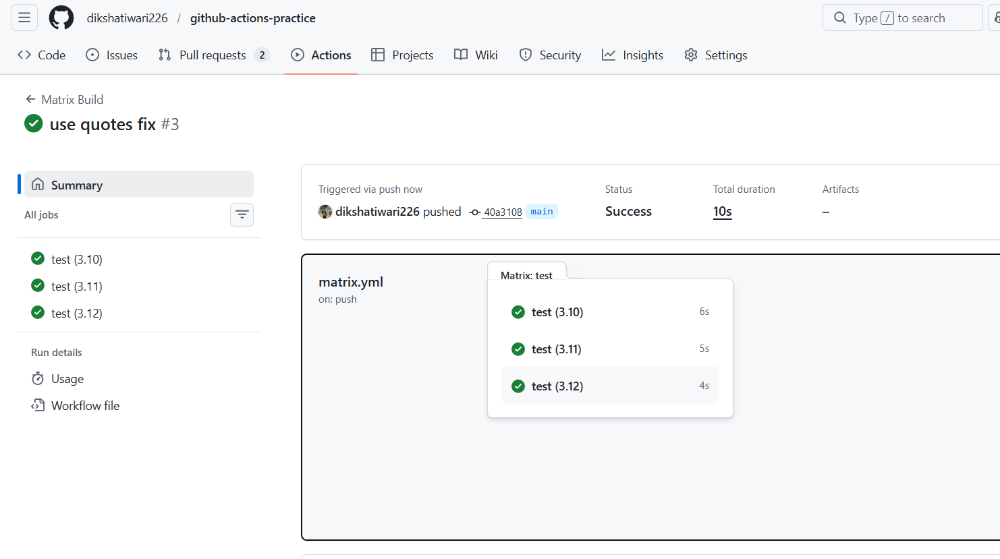
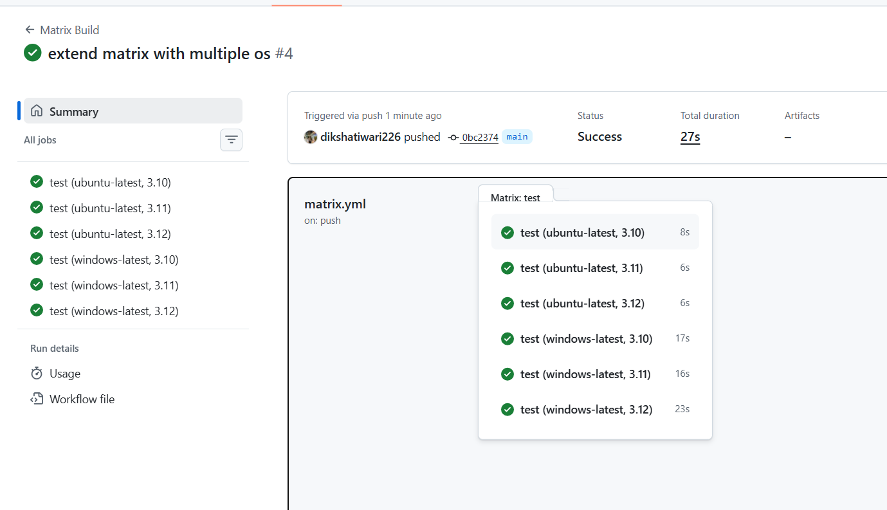
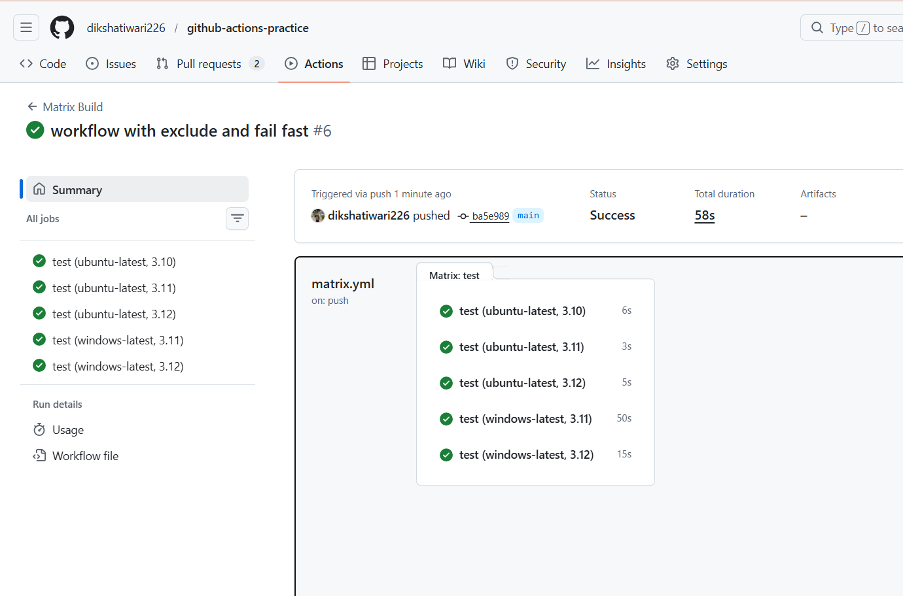

### Task 1: Trigger on Pull Request

### Task 2: Added Scheduled Trigger

## Cron expression for every Monday at 9 AM

## 0 9 \* \* 1

## Meaning:

**0 → minute**
**9 → hour**
**\*- → any day**
**\* → any month**
**1 → Monday**

---

### Task 3: Manual Trigger

### Task 4: Matrix Builds

### Task 5: Exclude & Fail-Fast

---

2️⃣ What Happens

Matrix combinations before exclusion:

2 OS × 3 Python versions = 6 jobs

Excluded combination:

Windows + Python 3.10

So total jobs:

6 - 1 = 5 jobs

All 5 jobs run, even if one fails because:

fail-fast: false
📝 Notes (Short Answer)

fail-fast: true (default)

If one job in the matrix fails, GitHub cancels all remaining jobs.

fail-fast: false

If one job fails, other matrix jobs continue running.
