### Task 1: GitHub-Hosted Runners

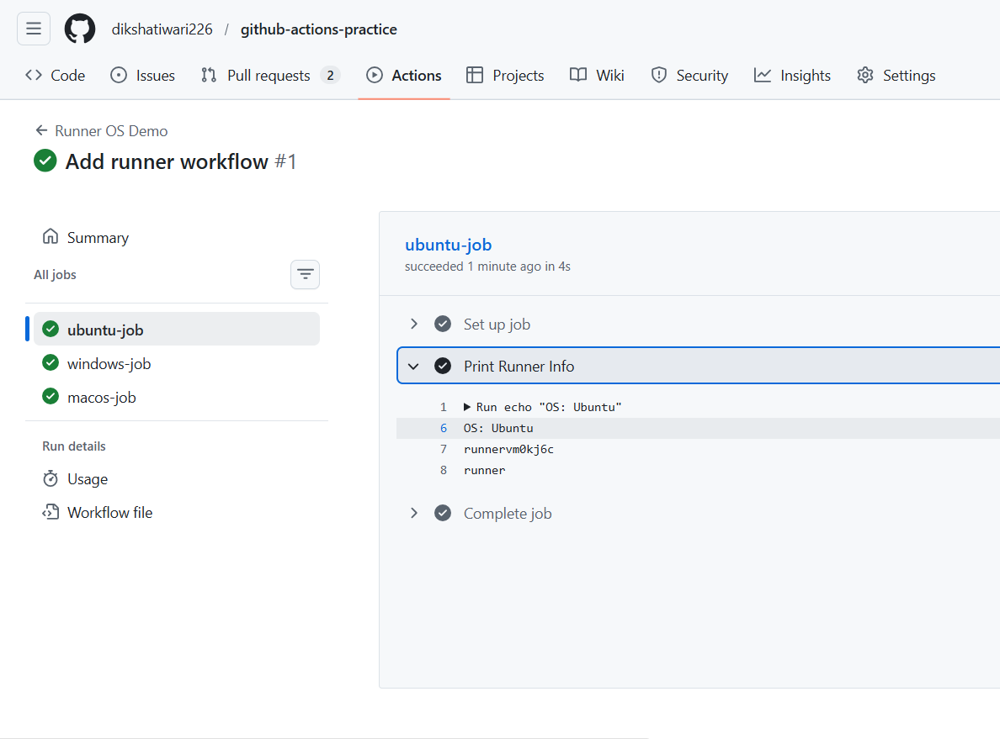
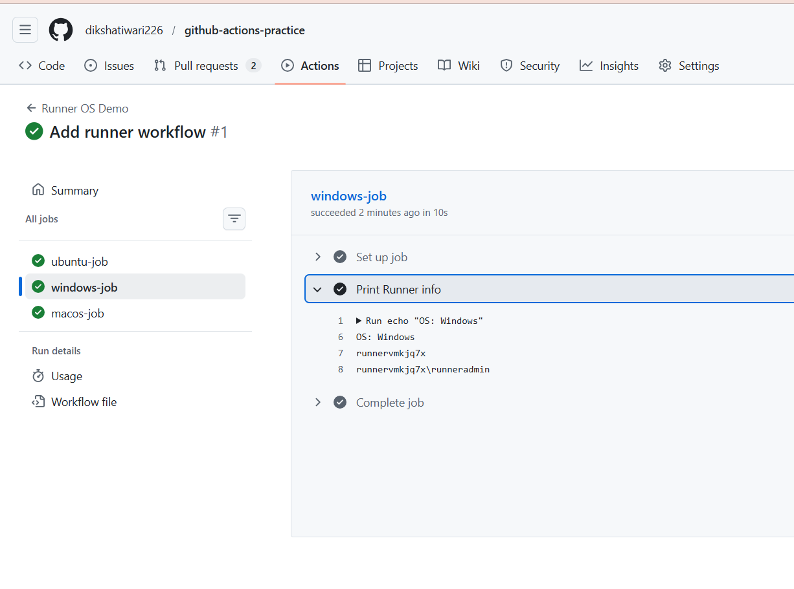
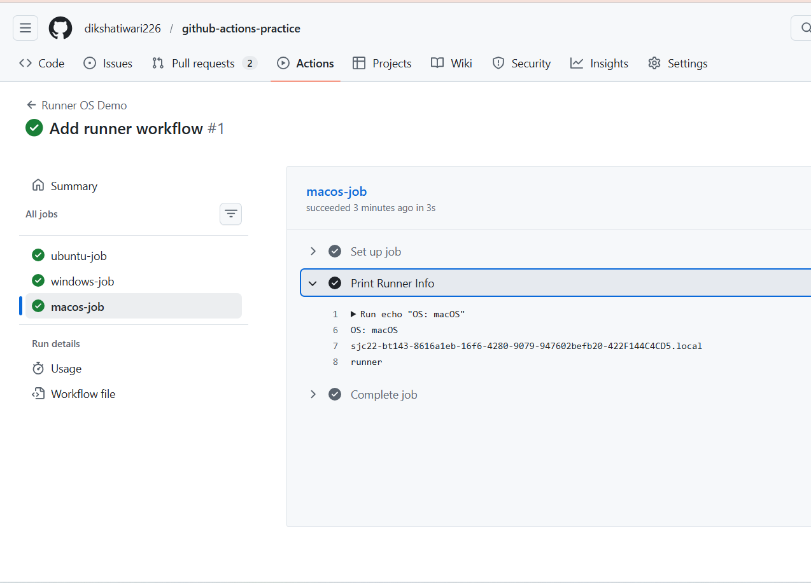

📝 Notes (Short Answer)

What is a GitHub-hosted runner?
A GitHub-hosted runner is a virtual machine provided by GitHub to run workflows.

Who manages it?
GitHub creates, manages, and maintains the infrastructure and environment automatically.

---

### Task 2: Explore What's Pre-installed

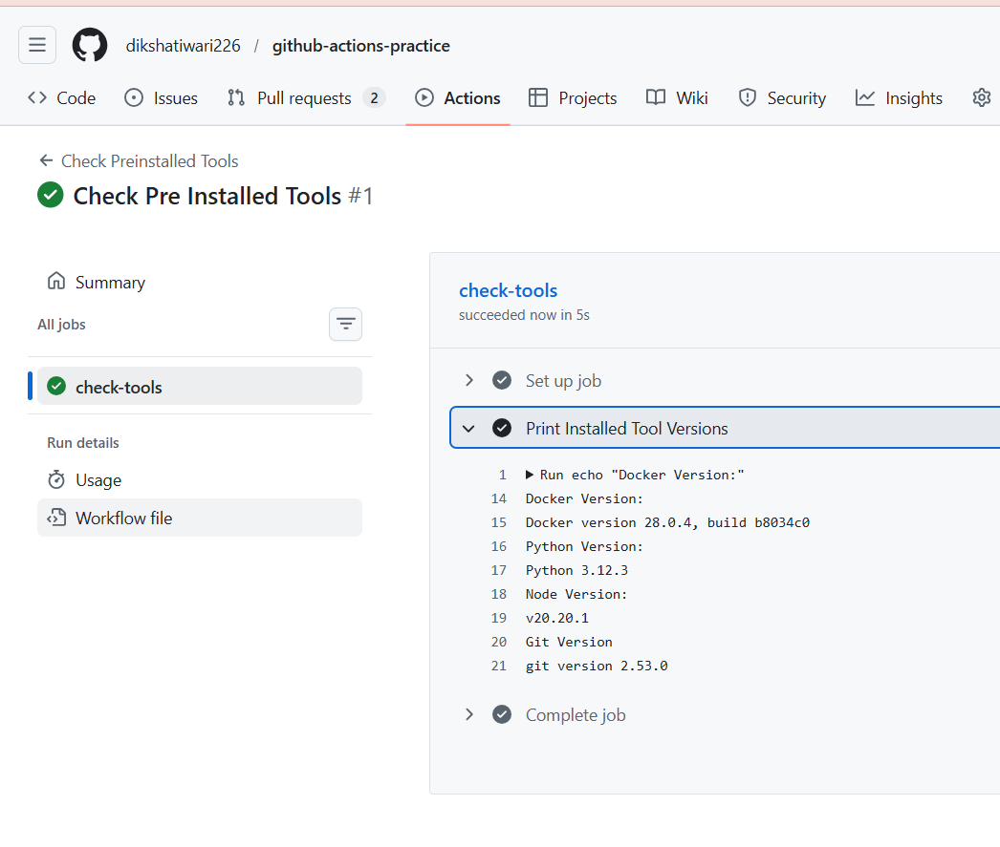

📝 Notes (Short Answer)

Why does it matter that runners come with tools pre-installed?

Because it saves setup time and speeds up CI/CD pipelines. Developers don't need to manually install common tools like Docker, Node, Python, or Git, making workflows faster and easier to maintain.

---

### Task 3: Set Up a Self-Hosted Runner

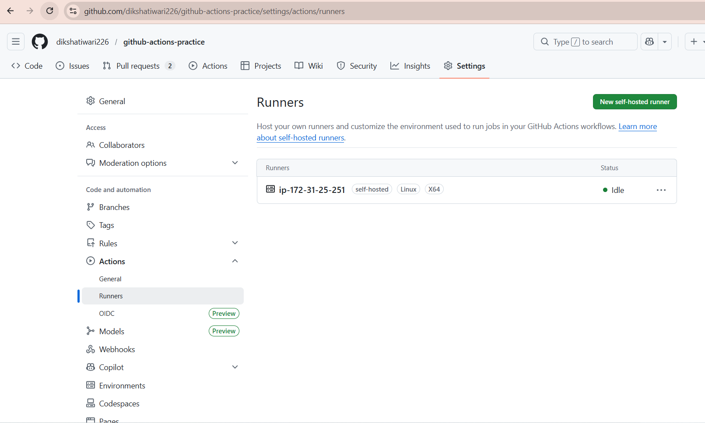
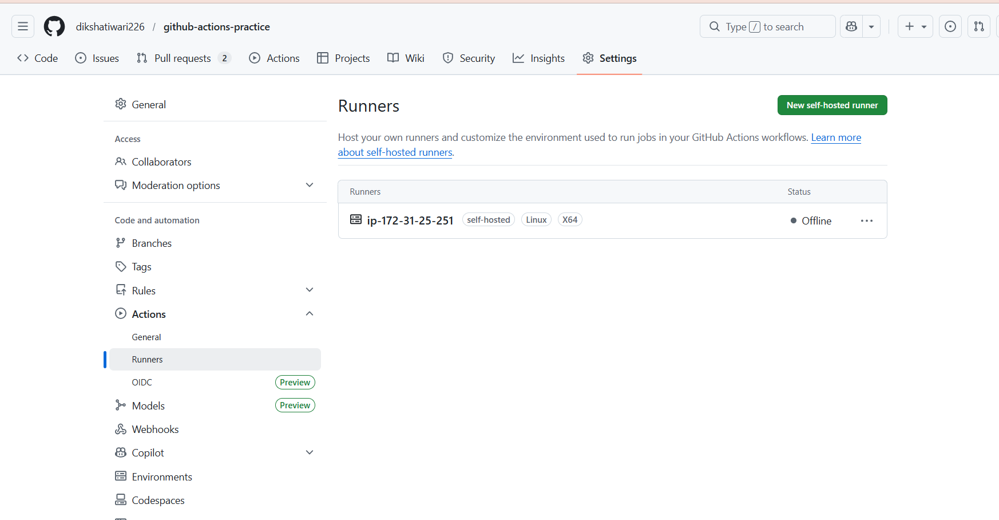
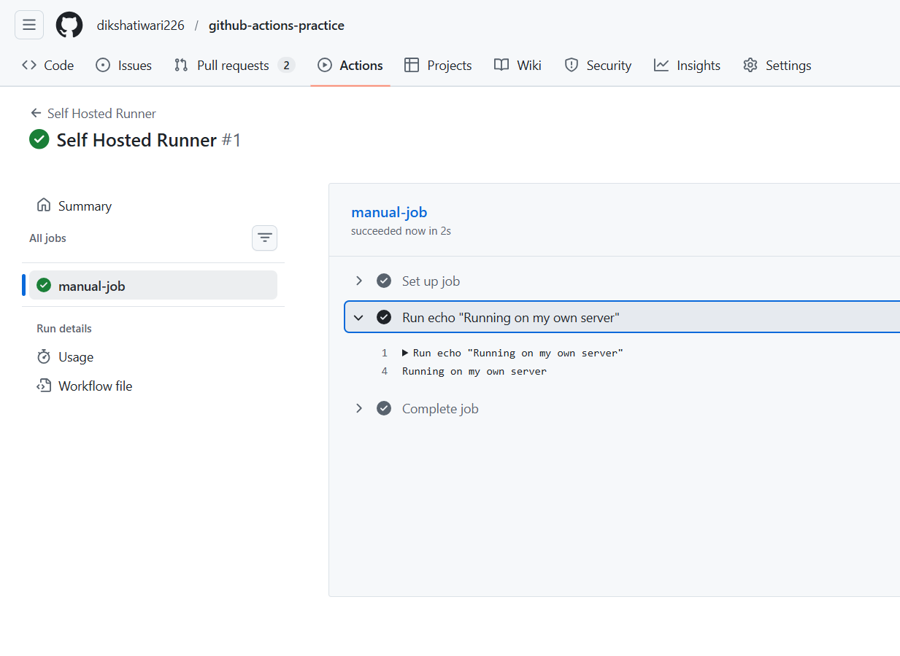

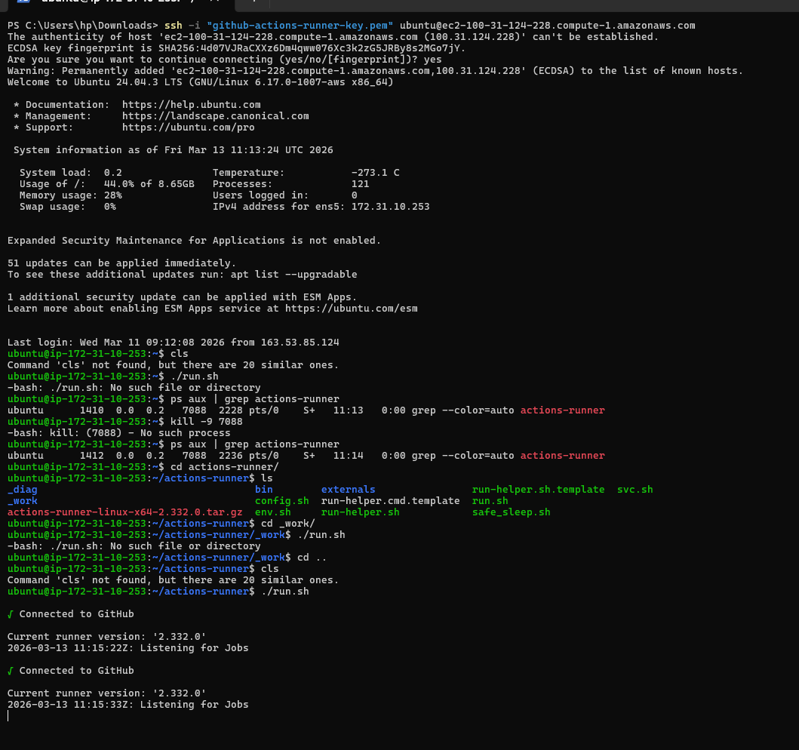

📝 Notes (Short Answer)

Self-hosted runner:
A machine that you manage and connect to GitHub to run workflows instead of using GitHub’s hosted infrastructure.

---

### Task 4: Use Your Self-Hosted Runner

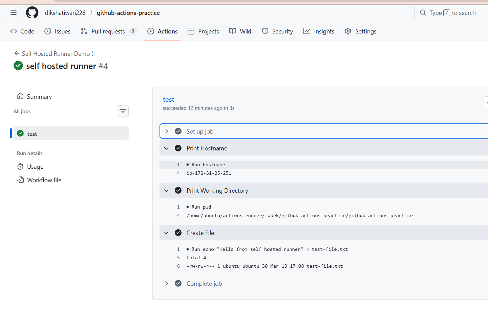
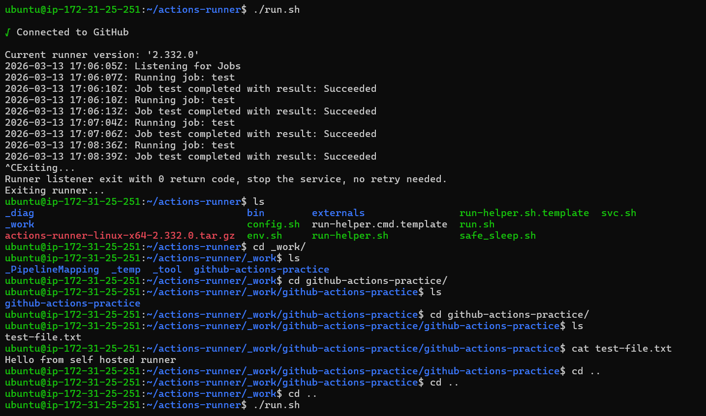

---

### Task 5: Labels

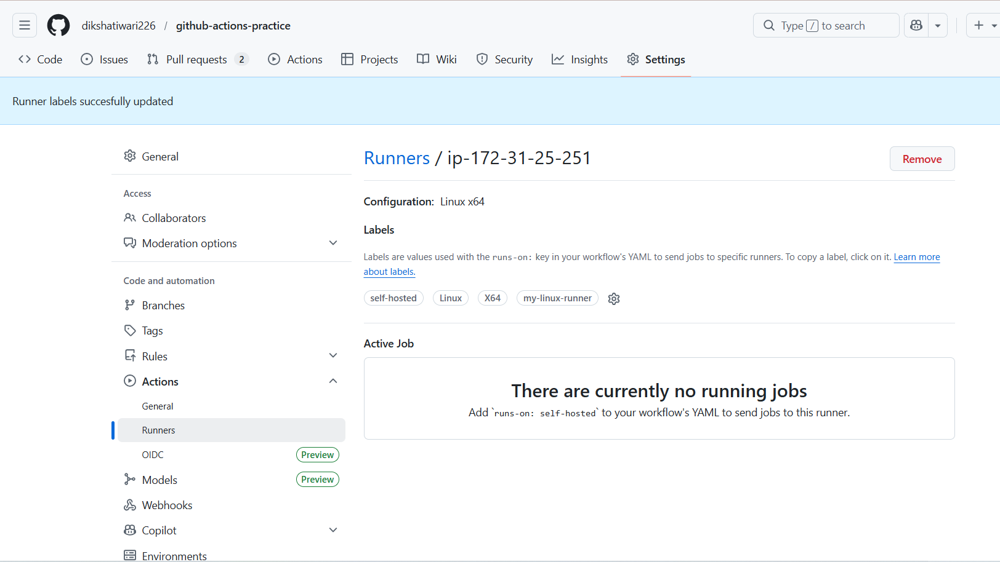
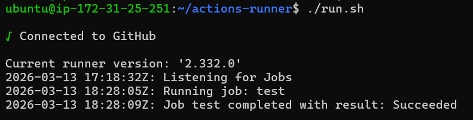

📝 Notes (Short Answer)

Why are labels useful when you have multiple self-hosted runners?

Labels help target specific runners with required environments or resources (OS, GPU, tools). They ensure workflows run on the correct machine when multiple runners are available.

Example:
gpu-runner
linux-docker-runner
high-memory-runner

This allows better job routing and resource management in CI/CD.

---

### Task 6: GitHub-Hosted vs Self-Hosted

|                         | GitHub-Hosted                                            | Self-Hosted                                                  |
| ----------------------- | -------------------------------------------------------- | ------------------------------------------------------------ |
| **Who manages it?**     | GitHub manages the infrastructure                        | You manage the machine/server                                |
| **Cost**                | Free minutes (limited) then paid                         | You pay for your own server/VM                               |
| **Pre-installed tools** | Many tools already installed (Docker, Node, Python, Git) | You install and manage tools yourself                        |
| **Good for**            | Simple CI/CD, quick setup, standard builds               | Custom environments, private network access, heavy workloads |
| **Security concern**    | Safer (isolated runner per job)                          | Risk if untrusted code runs on your machine                  |
